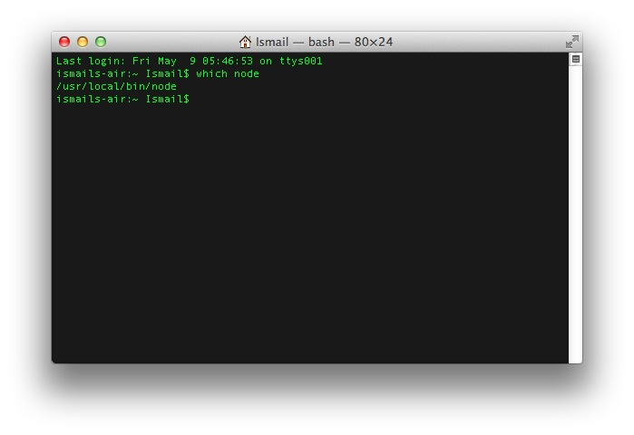
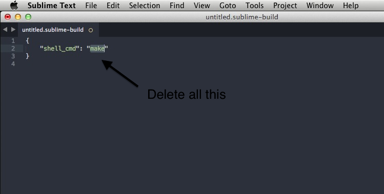
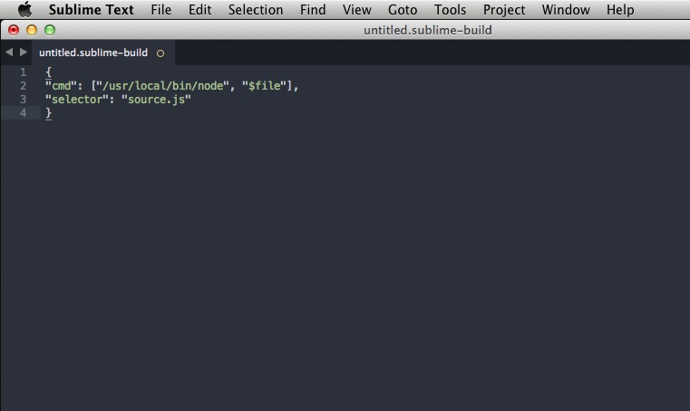
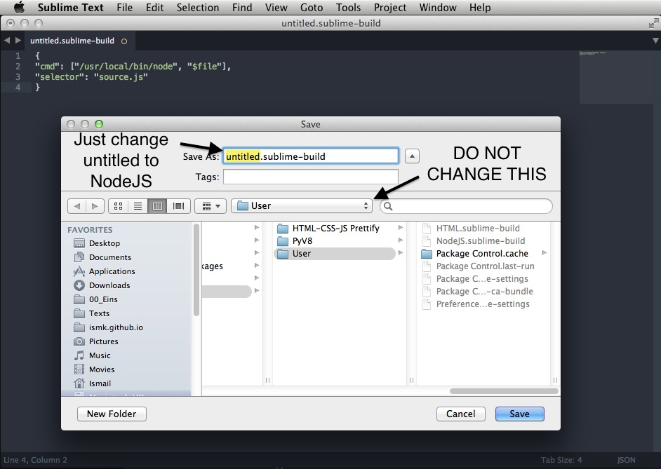
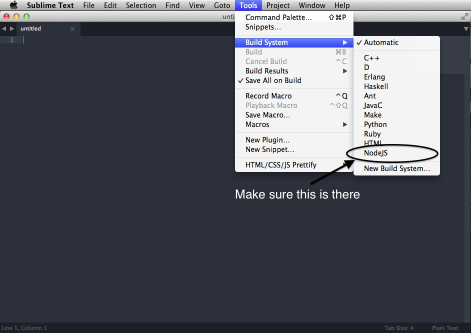

######Update 2 **Okay windows people I might have a solution, could you try the windows verison of the code in step 5 and let me know ?**

######Update 1 **Okay so Marek got back to me and show me how to make this work in Linux you just have to change the code a little bit in step 5. Go check it out below! By scouring the web and reading some stackoverflow posts I have found a way to run JavaScript files inside sublime, that way one doesn’t have keep going back and forth between saving the .js file in sublime text and opening in it terminal and running it there.

1. First you’ll have to install Node.js from nodejs.org

2. Make sure its properly installed by opening Terminal and running this command which node (Windows Users the command is "where node") it should print out the path of nodejs

3. Awesome, Now open Sublime Text, Goto Tools > Build System > New Build System.

4. Now Delete all the code in the file.

5. Now Paste the following code in it: For OSX: { "cmd": ["/usr/local/bin/node", "$file"], "selector": "source.js" } For Linux: { "cmd": ["/usr/bin/nodejs", "$file"], "selector": "*.js" } For Windows: { "cmd": ["node", "$file"] }

6. Now Either Goto File > Save or CMD + S and on the file save dialog DO NOT CHANGE THE USER Folder, and rename the untitled.sublime-build to NodeJS.sublime-build.

7. Now Make sure NodeJS build system shows up.

8. Now try running the file by Either going to Tools > Build or use CMD+B Make sure to save the file first and it has to have an extension .js
Please leave comments on the Google+ Post. :)
