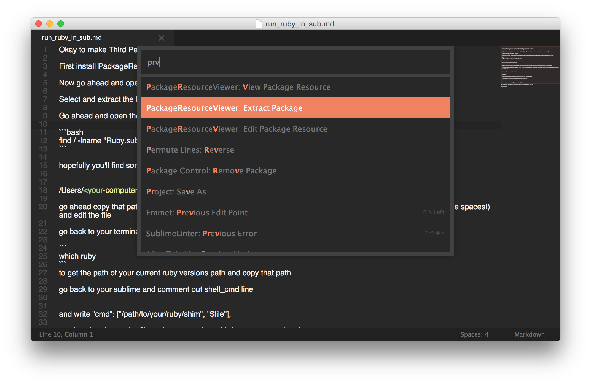
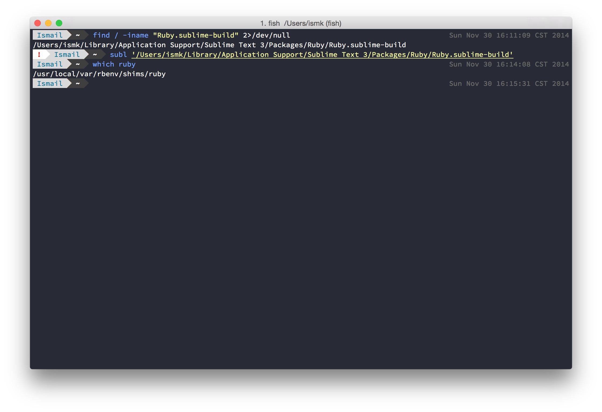

**I am using Sublime Text 3 and Rbenv to manage my Ruby versions and this guide is catered for that**

Okay to make Third Party Gems like Faker run in Sublime Text 3 you would want to do is

First install PackageResourceViewer from Package Control in Sublime



Now go ahead and open Command Prompt and type ```prv``` and scroll down and select Extract Package

Select and extract the Ruby Package

Go ahead and open the terminal and use this commad in the terminal to locate the build file sublime uses for Ruby

```bash
find / -iname "Ruby.sublime-build" 2>/dev/null
```




hopefully you'll find something like


/Users/<your-computer-name>/Library/Application Support/Sublime Text 3/Packages/Ruby/Ruby.sublime-build

go ahead copy that path and run subl '<path_name>' (Don't forget to put quotes around the path, terminal doesn't like spaces!) and edit the file

go back to your terminal and type

```
which ruby
```
to get the path of your current ruby versions path and copy that path

go back to your sublime and comment out shell_cmd line


and write "cmd": ["/path/to/your/ruby/shim", "$file"],

go ahead and save the file and try to require a third party gem and run!

WOOHOO SUCCESS!!!

