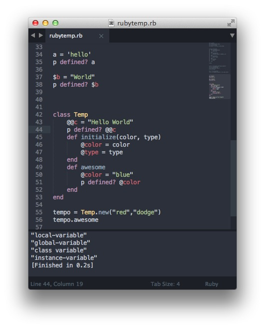

##What is Scope?

Scope is basically what context the variable is declared in, is it the variable declared in a loop, a class, method ? etc. Therefore it is important to note where one declares their variables and where they will be accessible. Why is this important you ask ? Sometimes you want compartmentalize the variables so that its not easily overwritten also can be either for security or more readability.

###Kinds of Variables

####Global Scope

When defining global scope, the variables would be accessible from any of the class or methods. Global scope is declared by using the prefix '$' sign before the variable name => $variable-name

		$color = "blue"

####Class Scope

When defining class scope, the variables will be accessible only in the class its created in and not outside of it. simple. Class scope is declared by using the prefix '@@' sign before the variable name => @@variable-name

		@@color = "red"

####Instance Scope

When defining instance scope, the variables will be accessible only inside of the class and cannot have any effect outside the class.Instance scope is declared by using the prefix '@' sign before the variable name => @variable-name

		@color = "yellow"

####Local Scope

When defining local scope, the variables which are declared outside of the class and objects, and cannot have any effect inside the class its not defined in, this goes for the methods too.Local scope does not need any prefix to be declared => variable-name

		color = "white"